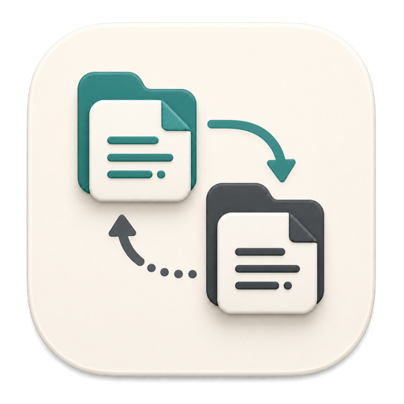
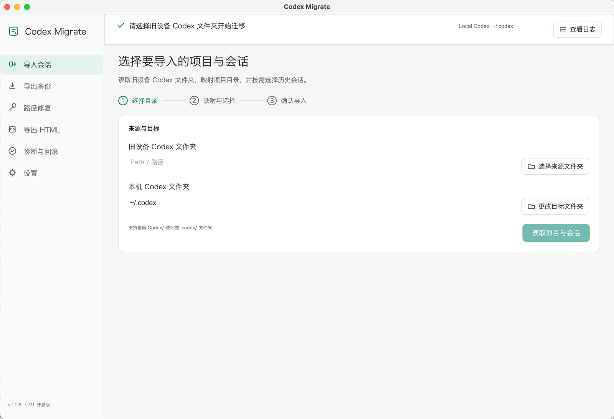
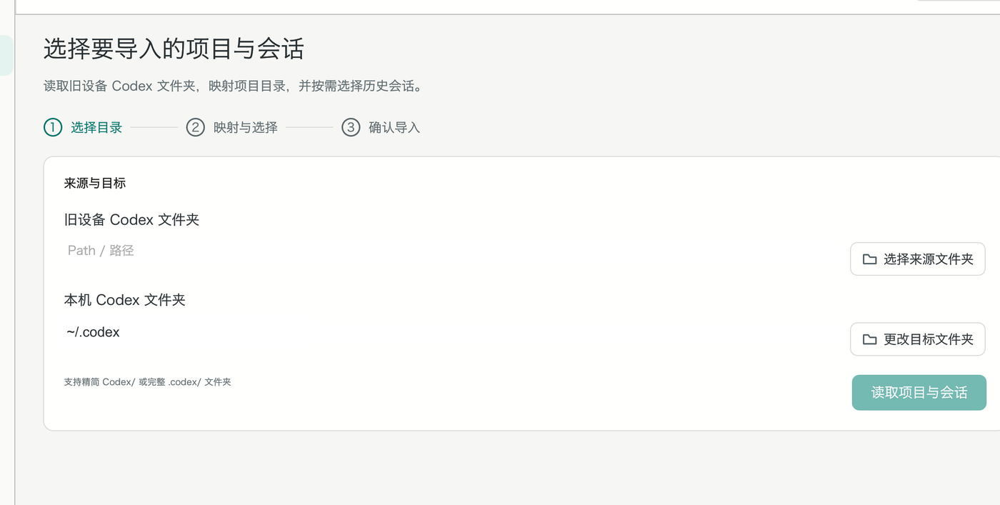
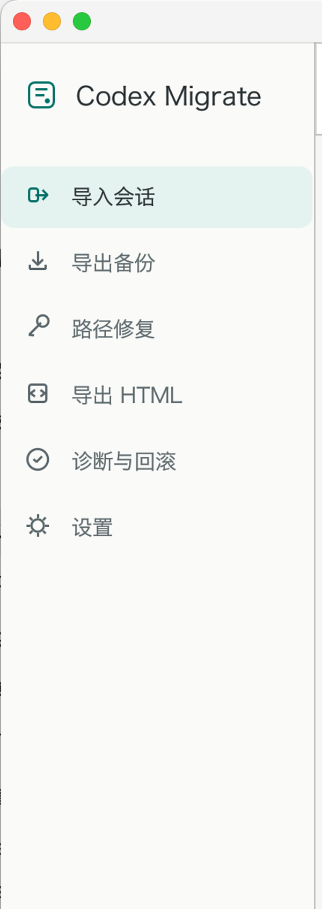

<p align="center">
  
</p>

<h1 align="center">Codex Migrate</h1>

<p align="center">
  A local-first, cross-platform tool for migrating, repairing, backing up, and exporting Codex sessions.
</p>

<p align="center">
  <a href="README.zh-CN.md">简体中文</a> ·
  <a href="#installation">Installation</a> ·
  <a href="#safety">Safety</a> ·
  <a href="CONTRIBUTING.md">Contributing</a>
</p>

> [!IMPORTANT]
> Codex Migrate is an independent community project. It is not affiliated with, endorsed by, or sponsored by OpenAI. “Codex” and other OpenAI marks belong to OpenAI.

Codex Migrate works directly with a copied `.codex/` directory or a minimal `Codex/` backup. It uses rollout JSONL files as the source of truth and can merge selected sessions into an existing local Codex environment.

## Screenshots

<p align="center">
  
</p>

<table>
  <tr>
    <td width="68%">
      
    </td>
    <td width="32%">
      
    </td>
  </tr>
  <tr>
    <td align="center">Three-step migration workflow</td>
    <td align="center">Migration and maintenance tools</td>
  </tr>
</table>

## Features

- Migrate active and archived sessions across macOS, Windows, Linux, and WSL.
- Select individual projects and sessions before importing.
- Map old project paths to folders on the new device.
- Apply parent-directory mappings to many projects at once.
- Repair project paths in an existing `.codex` directory.
- Detect identical, prefix-compatible, and divergent session UUIDs.
- Create rollback snapshots before writes and delete old snapshots from the GUI.
- Export selected conversations as self-contained HTML, including embedded user images and tool screenshots.
- Use a native GUI in Chinese or English, following the system language by default.
- Use the same migration engine from the command line.

## Data boundaries

The backup exporter includes:

```text
Codex/
├── sessions/
├── archived_sessions/
└── session_index.jsonl
```

It intentionally excludes authentication, Skills, configuration, plugins, logs, caches, device state, and the source database.

> [!WARNING]
> Rollout and HTML files may contain sensitive conversations, commands, output, images, and local paths. Review them before sharing.

## Installation

Download a build for your platform from the repository’s **Releases** page.

- Windows: extract the ZIP and run `Codex Migrate.exe`.
- macOS: extract the ZIP and move `Codex Migrate.app` to Applications. On first
  launch, Control-click the app and choose **Open**. If macOS still blocks it,
  use **System Settings → Privacy & Security → Open Anyway**.
- Linux: extract the archive and run `codex-migrate-gui`.

Release builds are not currently signed with commercial certificates or
notarized by Apple. Windows SmartScreen or macOS Gatekeeper may show a warning.
Always verify the release checksum before running a downloaded binary.

## Build from source

Requirements:

- Rust stable toolchain
- Platform build tools supported by `eframe`

```bash
git clone https://github.com/ChenglongLi777/codex-migrate.git
cd codex-migrate
cargo test --all-targets --features gui
cargo build --release --features gui --bins
```

macOS application bundle:

```bash
./scripts/package-macos.sh
```

Generated executables:

```text
target/release/codex-migrate
target/release/codex-migrate-gui
```

## Typical GUI workflow

1. Quit Codex Desktop and all Codex CLI sessions.
2. Select the old `.codex/`, a minimal `Codex/`, or a parent containing exactly one of them.
3. Select the projects and sessions to import.
4. Bind each selected old project path to its new local folder, apply a parent mapping, or choose history-only recovery.
5. Preview the merge plan.
6. Confirm the import and reopen Codex after completion.

## Merge rules

| Source and target state | Result |
| --- | --- |
| UUID does not exist locally | Import |
| UUID and content hash match | Skip and refresh indexes |
| Target rollout is a full prefix of source | Use the longer source |
| Source rollout is a full prefix of target | Keep the longer target |
| Same UUID has divergent content | Stop and report a conflict |

The tool does not splice divergent JSONL files or silently generate a new UUID.

## Safety

- Checks whether the target SQLite database is in use.
- Uses SQLite Online Backup for database snapshots.
- Stages rollout files before moving them into place.
- Updates only detected schema fields.
- Automatically restores the snapshot if an import fails.
- Stores rollback data under:

```text
$CODEX_HOME/migration_transactions/<TRANSACTION_ID>/
```

Deleting rollback data only removes the selected snapshot directories; it does not modify current sessions.

## CLI examples

```bash
codex-migrate export ~/.codex --output-parent ~/Backups
codex-migrate scan ~/Backups/Codex

codex-migrate import ~/Backups/Codex --dry-run \
  --map '/Users/alex/Projects=D:/Projects'

codex-migrate import ~/Backups/Codex \
  --map '/Users/alex/Projects=D:/Projects'

codex-migrate rebind --codex-home ~/.codex \
  --map '/old/projects=/new/projects' --dry-run

codex-migrate export-html --codex-home ~/.codex --thread THREAD_ID
codex-migrate verify
codex-migrate rollback TRANSACTION_ID
```

Run `codex-migrate --help` for the complete interface.

## Project status

This project relies on local Codex storage structures that may change between Codex versions. Compatibility fixes and real-world reports are welcome. Before opening a bug report, remove conversations, credentials, usernames, and private paths from logs and screenshots.

## License

MIT. See [LICENSE](LICENSE).
